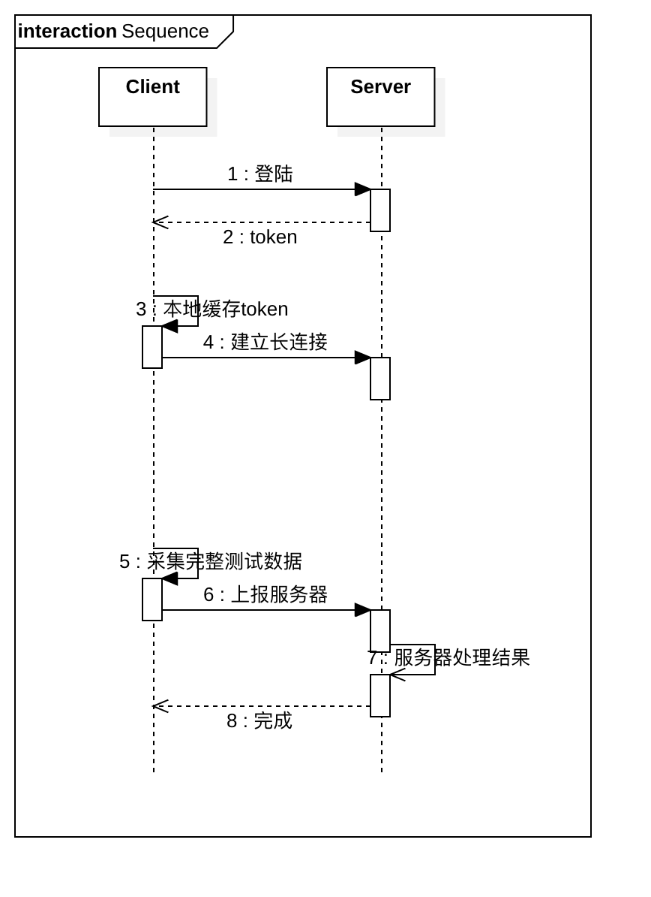
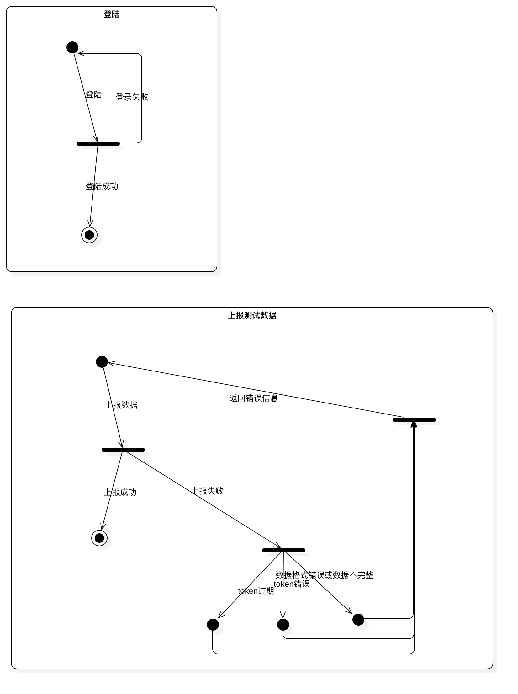

## 通信协议

#### 技术要求

1.  通信利用以太网络
2.  外部系统在通信之初主动向检测台终端请求建立通信连接。外部系统判断出连接中断时重新请求建立连接。
3. 	通信采用TCP/IP长连接协议进行数据传输，检测台终端为服务端，外部系统为客户端，格式为字符串（JSON格式）。
4. 	采用主动发送、定时心跳、查询应答、CRC校验机制。
    *  主动发送：
    	检测台终端主动向外部系统发送检测数据。发送时机为检测数据产生时；*允许在检测台终端上手动重发检测数据。*
    *  定时心跳：
    	首次建立链接时获取token，后通过token刷新有效期，发呆时间为4小时。
    	检测台终端定时向外部系统发送“心跳”，时间间隔1秒。

#### 基本通信格式

1.  请求头（header）：

    *   token：用来验证上传信息权限
    *   time：请求时间Unix时间戳(10位)

2.  载荷（payload）：

    *   字段名称：payload

    *   通过struct类组成基本单元

    *   如多个测试项，需使用数组包裹

3.  举例：

    ```json
    {
        "header":{
            "token":"12345",  // 令牌内容
            "processed_at":"1558704644"  // 测试时间
        }，
        "payload":[
        	{
        		"entire_instance_identity_code":"Q010101B04900000001",  // 整件设备唯一编号
                "part_instance_identity_code":"",  // 部件设备唯一编号(如存在)
                "measurement_identity_code":"B049ME2019051611011401011557975674",  // 测试模板唯一编号
                "measured_value":"100",  // 实测值
                "processor_id":"1",  // 测试人编号
                "serial_number":"B049201905201054193",  // 测试记录流水号(段编号+年月日时分秒+测试项序号)
                "type":"ENTIRE"  // 整件测试：ENTIRE，部件测试：PART
    		},
        	// ....
        ]
    }
    ```

4.  操作流程

    

